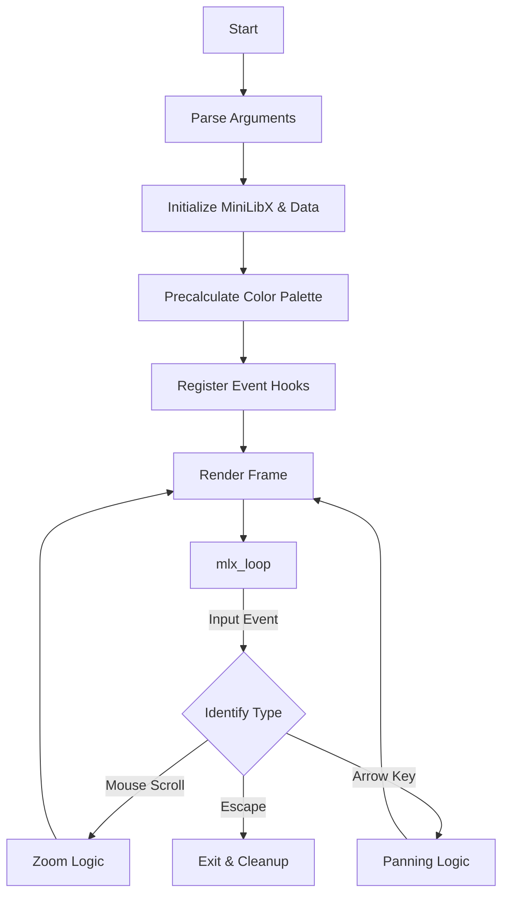

# fract-ol - Fractal Explorer

*This project was created as part of the 42 curriculum by rafael-m.*

---

## Description
`fract-ol` is a visually interactive fractal explorer designed to render complex mathematical sets like Mandelbrot and Julia. The project focuses on utilizing the **MiniLibX** graphics library to handle real-time rendering, user input, and optimized mathematical computations to provide a smooth exploration experience.

The core objective is to understand the representation of complex numbers on a 2D plane and implement efficient algorithms to visualize the "escape time" of these sets.

## Instructions

### Prerequisites
- GCC compiler
- Make
- X11 development libraries (libXext, libX11, libbsd)

### Compilation
- `make` to compile the application.
- `make clean` to remove object files.
- `make fclean` to remove object files and the binary.
- `make re` to recompile everything.

### Execution
Run the program with a fractal set name and optional parameters:
```bash
./fractol [mandelbrot|julia1|julia2] [WIDTH=n] [LENGTH=n] [I=n]
```

#### Parameters:
- `mandelbrot`: Renders the Mandelbrot set.
- `julia1`: Julia set with constant $c = 0.279 + 0i$.
- `julia2`: Julia set using a cubic formula with constant $c = 0.400 + 0i$.
- `WIDTH=n` / `LENGTH=n`: Sets the window resolution (default 500x500).
- `I=n`: Sets the maximum iterations (default 100). Higher values yield more detail but require more processing power.

### Structures & Algorithms

#### Key Structures
- `t_data`: A central structure containing the MiniLibX pointers (`mlx`, `win`, `img`), fractal state (zoom, center coordinates), and the precalculated color palette.
- `t_complex`: Represents a complex number $(a + bi)$ using two doubles.

#### Algorithms & Optimizations
- **Escape Time Algorithm**: The standard iterative method for determining if a point in the complex plane belongs to the set.
- **Arithmetic Optimization**: Replaced expensive `pow()` calls with direct multiplications (e.g., `x*x - y*y` instead of `pow(x, 2)`), drastically reducing the CPU cycles required for each pixel.
- **Color Palette Precalculation**: During initialization, a color palette is generated using sine waves and stored in an array. This allows for O(1) color lookups during rendering, avoiding thousands of trigonometric calculations per frame.
- **Dynamic Panning**: Arrow keys move the view by a delta that scales inversely with the zoom level, maintaining precise control at high magnification.

### Execution Flow


## Resources
- [MiniLibX Documentation](https://harm-smits.github.io/42docs/libs/minilibx)
- [The Mandelbrot Set - Wikipedia](https://en.wikipedia.org/wiki/Mandelbrot_set)
- [Julia Set - Wikipedia](https://en.wikipedia.org/wiki/Julia_set)

### AI Usage
AI was utilized in this project for the following tasks:
- **Refactoring & Optimization**: Assisting in the transition from `pow()` functions to direct arithmetic multiplications in the inner fractal loops.
- **Logic Debugging**: Identifying and fixing a critical bug in the command-line argument parser related to destructive modification of `argv`.
- **Feature Implementation**: Generating the initial logic for dynamic panning and precalculating the trigonometric color palette.
- **Documentation**: Structuring this README and technical reports using specialized documentation tools.

---

## Tech Stack


- **Language**: C (GNU89 Standard)
- **Library**: MiniLibX (X11)
- **Tooling**: GNU Make, Norminette 4.0
