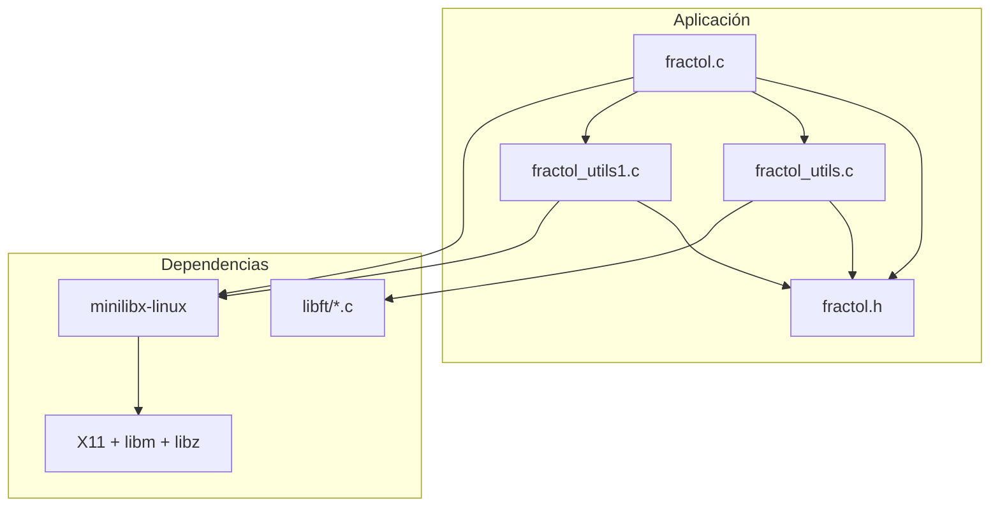

# Arquitectura de fract-ol

## Visión arquitectónica
- La aplicación construye un único binario `fractol` que inicializa MiniLibX, crea la ventana y delega el renderizado en funciones específicas del conjunto fractal.
- El flujo principal (`fractol.c`) prepara la estructura `t_data`, procesa los parámetros CLI, inicializa recursos y entra en el bucle de eventos de MiniLibX.
- Las rutinas de renderizado (`fractol_utils.c`) generan los pixeles de Mandelbrot o de las dos variantes de Julia, reutilizando utilidades numéricas de `libft`.
- El módulo de eventos (`fractol_utils1.c`) encapsula la interacción con MiniLibX (cerrado de ventana, clicks de zoom y control por teclado), manteniendo el estado en `t_data`.
- No se encontró un subject incluido en el repositorio, de modo que el análisis está basado en la inspección directa de código y dependencias empaquetadas.

## Tecnologías empleadas
- C99 con `gcc` para la compilación.
- MiniLibX (`minilibx-linux`) para la gestión de ventana, eventos y framebuffer.
- X11 (`libX11`, `libXext`) como backend gráfico requerido por MiniLibX.
- Biblioteca matemática (`libm`) y compresión (`libz`) enlazadas desde el Makefile.
- `libft` como librería auxiliar con utilidades de strings, listas y parsing.
- `make` como herramienta de orquestación de la construcción.

## Estructura del proyecto
- `Makefile`: define el flujo de compilación del binario `fractol`, enlaces y reglas de limpieza.
- `.vscode/`: configuración de editor para intellisense y depuración local.
- `fractol.h`: definiciones de tipos (`t_data`, `t_complex`) y prototipos compartidos.
- `fractol.c`: punto de entrada, gestión de MiniLibX y dispatch de eventos.
- `fractol_utils.c`: creación de imagen, iteraciones Mandelbrot/Julia y parsing de CLI.
- `fractol_utils1.c`: utilidades de eventos (teclado, ratón) y helpers de framebuffer.
- `libft/`: implementación estática reutilizable de funciones auxiliares (string, memoria, listas, matemáticas).
- `minilibx-linux/`: dependencia gráfica de terceros incluida como submódulo vendorizado.
- `borrar.c`: programa de prueba puntual para utilidades de `libft` (fuera del flujo de build principal).
- `fractol`, `a.out`: artefactos binarios generados tras la compilación (pueden regenerarse vía `make`).

## Mapa de arquitectura

